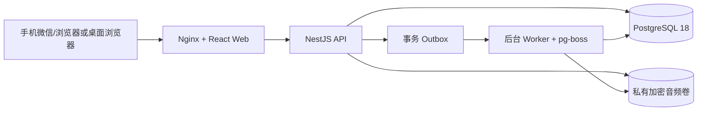
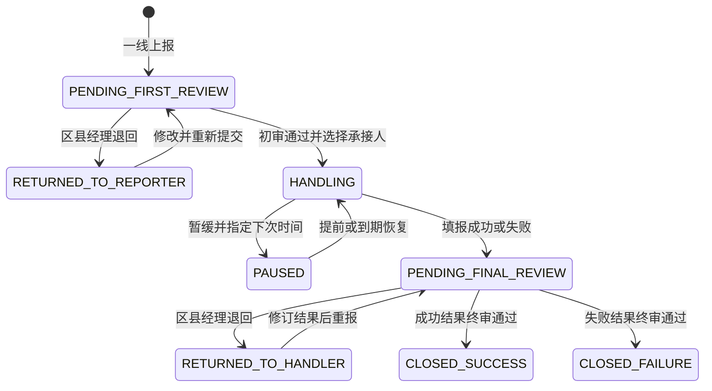

# 架构与核心算法

## 1. 架构边界

系统采用模块化单体，HTTP API 与异步 worker 使用同一业务代码和同一 PostgreSQL 数据库，避免在首版引入分布式事务。Web 仅通过 `/api/v1` 访问后端；音频只能经鉴权接口读取，Nginx 不暴露存储卷。

模块职责：

- `auth`：手机号＋密码、服务端会话、首次强制改密、一次性导出再验证令牌。
- `admin`：分层账号管理、多角色/多区县授权、人员表同步、职务建议模板、区县启停、承接覆盖统计和留存清理确认。
- `opportunities`：固定问卷、密文快照、可见范围、列表、详情、时间线。
- `workflow`：状态机、审批/处理动作、分派、并发版本、幂等、SLA 轮次、通知和 Outbox。
- `audio`：类型/魔数/大小/时长校验、独立密钥加密、鉴权播放、90 天清理。
- `municipal`：成功商机库、访问审计、流式导出。
- `worker`：Outbox 投递、半程提醒、超时标记、暂缓恢复和到期清理。

## 2. 状态机

`REASSIGN` 是 `HANDLING` 或 `PAUSED` 内部迁移：状态不变，但当前分派失效、新分派生效，版本号和审计事件均递增。

## 3. 统一状态迁移算法

所有审批、处理结果、暂缓、恢复和改派调用 `WorkflowService.execute()`：

1. 强制读取 `Idempotency-Key`，组成 `用户＋当前授权＋商机＋事件` 作用域并计算请求体 SHA-256。
2. 命中同键同请求时返回原响应；同键不同请求返回 `409 IDEMPOTENCY_KEY_REUSED`。
3. 开启数据库事务，对商机执行 `SELECT … FOR UPDATE`。
4. 再次检查幂等记录，避免并发请求在第一次查询后同时进入。
5. 检查 `expectedVersion`；不一致返回 `409 VERSION_CONFLICT`。
6. 根据当前授权检查角色、区县和当前承接关系；系统管理员没有正文读取或流转权限。
7. 使用 XState 状态机计算下一状态；非法边返回 `422 INVALID_TRANSITION`。
8. 校验事件载荷并更新分派、处理结果、SLA、通知、留存候选和 Outbox。
9. 追加不可变 `workflow_events`，更新状态并将版本加一。
10. 在同一事务写入幂等响应，提交后返回新状态和版本。

这使重复点击、网络重试和两个审批人同时操作都得到确定结果，不依赖前端按钮防抖保证正确性。

固定“具体需求”先去空格、去重并按共享的 10 项白名单校验，再序列化为 JSON 数组后整体加密。不能使用中文顿号拼接，因为合法菜单项本身含有顿号。读取时优先解析 JSON；对升级前的旧记录，按完整菜单值及两项有序组合匹配恢复，界面和导出统一以分号展示，不改变选项原文。

## 4. 承接候选池与初审分派算法

`role_grants` 是账号权限和承接配置的唯一事实来源，不再维护独立的区县路由表：

1. 一线上报或退回重报时，服务端先确认区县处于启用状态，并检查该区县至少有一名有效区县经理及一名与客户类型匹配的有效承接人；覆盖不足时整个事务拒绝，不创建半成品商机或 SLA。
2. 提交成功后，对本区县所有有效区县经理去重并逐一创建待审通知，任何一名经理都可在 24 小时内处理。
3. 初审页面按 `(districtId, customerType)` 查询候选池：个人客户只返回 `PERSONAL_HANDLER`，组织客户只返回 `ORGANIZATION_HANDLER`；账号和授权均须有效。
4. 区县经理提交 `handlerGrantId`。状态迁移事务再次校验候选授权属于同一区县、分侧匹配且仍然有效，然后创建唯一活跃分派、结束初审 SLA，并把承接人姓名写入通知和不可变时间线元数据。
5. 处理中改派复用同一候选校验，另要求填写原因；旧分派立即失效，旧承接人失去正文读取权，但历史节点和关键人保留。
6. 承接人提交成功或失败结果时，对本区县所有有效经理创建 48 小时终审通知；不依赖某一名“默认经理”。

这样，“账号与角色”中的授权变化会立即反映到区县承接覆盖和后续候选池，无需在“区县与承接配置”中重复录入。

## 5. 分层账号管理算法

每个管理请求只按 `X-Role-Grant-Id` 指定的当前授权计算能力，不叠加用户的其他角色：

- `SYSTEM_ADMIN`：可查看和管理全区域全部账号、角色、区县、人员导入、职务模板与留存处置，但默认不能读取商机正文。
- `SENIOR_MUNICIPAL_ADMIN`：可管理全区域一线、区县经理、个人侧、组织侧及市公司角色；不能查看或管理高级市公司管理员、系统管理员，也不能启停区县或执行人员表上传。
- `DISTRICT_MANAGER`：只能搜索本区县具有下级角色的账号，只能创建、增加或停用本区县的一线上报人、个人侧和组织侧授权；看不到其他区县、同级经理和任何上级角色。停用下级授权不会停用整个账号。

账号列表先拼接服务端强制可见域，再叠加分页、状态、角色和区县过滤。姓名使用规范化后的包含查询；手机号因加密存储，只允许输入完整 11 位后转为 HMAC 盲索引精确查找。创建账号与首批授权在同一事务完成，避免出现无角色的半成品管理账号。

停用动作还有三类保护：有未办结分派的承接授权必须先改派；存在未办结商机时不能撤销该区县最后一名经理；不能撤销最后一个有效系统管理员。

## 6. 人员表同步算法

上传接口自动识别两种来源模板：完整人员表至少包含“人员编码、人员姓名”，联系人简表包含“姓名、联系电话”。处理流程为：

1. 读取首个工作表并规范化表头；仅映射账号与人员管理白名单字段，身份证、银行卡、家庭联系方式、附件及其他未批准列不落库，并在预检结果中给出忽略提示。
2. 联系人简表按手机号盲索引生成稳定的内部人员编码；完整表优先按人员编码匹配，并用个人/工作手机号盲索引交叉校验。编码与手机号命中不同人员时整批拒绝，防止静默串人。
3. `dryRun=true` 只计算新增、更新、停用、建号和关联数量，不写业务表；正式同步重新执行相同校验。
4. 大表按批次预取既有人员和账号，人员数据每 500 行通过参数化 `jsonb_to_recordset` 批量 upsert，避免逐行查询；手机号正文始终使用 AES-256-GCM，检索只使用盲索引。
5. `UPSERT` 只新增或更新；`SNAPSHOT` 只停用同一来源类型中本次缺失的人员，不删除账号。联系人简表命中完整目录人员时保留完整组织与职务资料。
6. 仅系统管理员显式启用管理岗位开通并通过预检后，简表才可把前 N 个有效联系人及指定表内手机号开通为系统管理员；同一人重复命中时只保留一条授权。新账号初始密码为手机号后 6 位并强制首次修改，既有账号不会被重置密码。
7. 职务与角色采用多对多建议模板；模板只在人工开通账号时预选角色，不会自动增加、撤销或变更权限。

## 7. SLA 算法

- 初审：每次提交或重报建立独立 `FIRST_REVIEW` 轮次；开始后 12h 提醒、24h 超时。
- 终审：每次承接人提交或重报结果建立独立 `FINAL_REVIEW` 轮次；24h 提醒、48h 超时。
- 审批通过或退回会结束当前轮次；退回后的重新提交创建新轮次，历史轮次不覆盖。
- Outbox 事件投递两个带 `slaRoundId` 的延迟任务。执行时重新检查轮次仍为 `ACTIVE`、时间已到且未处理；重复任务只会无操作返回。
- 超时只标记并通知，不锁死业务动作。

## 8. 暂缓恢复算法

承接人只能为未来一年内的时间创建暂缓。事务写入 `pausedUntil` 和带 `(opportunityId, expectedVersion)` 的 Outbox 事件。worker 到期后再次锁行，仅当状态仍是 `PAUSED`、版本仍匹配且时间已到时恢复；提前恢复、改派或其他版本变化会使旧任务自动失效。暂缓不进入终审，可重复发生。

## 9. 成功/失败结果不变量

- `SUCCESS` 只允许非空、去首尾空格、最多 200 字的 `successOpportunityName`。
- 请求 DTO 白名单和 `forbidNonWhitelisted` 拒绝金额、日期、产品、成功说明等额外字段。
- 数据库没有上述旧字段，并用检查约束保证成功名与失败原因互斥。
- 终审退回后可覆盖结果；终审通过进入终态后不能再修改。

## 10. Outbox 与 worker

业务事务只写 `outbox_events`。worker 使用 `FOR UPDATE SKIP LOCKED` 分批认领，向 pg-boss 投递具有 `singletonKey` 的延迟任务，成功后标记 `processedAt`；失败则增加次数、记录截断后的错误并推迟 30 秒。任务处理器仍以业务表状态为最终幂等条件。

## 11. PII 与检索

- 电话、联系方式、具体需求、说明、退回/改派/失败原因和成功商机名称使用 AES-256-GCM；每个值生成独立 96 位 IV 和认证标签。
- 手机号与联系方式用 HMAC-SHA-256 盲索引做精确查找。
- 成功商机名称生成规范化二元字符 HMAC 数组并使用 PostgreSQL GIN，支持不泄露明文的至少两字包含检索。
- API、数据库日志和 Outbox 不写原始坐标（本版本无定位）或明文正文。

## 12. 导出算法

1. 市公司用户输入当前密码，服务端生成 5 分钟、一次性、只存哈希的再验证令牌。
2. 导出先原子消费令牌，再按筛选预估行数；超过 50,000 行拒绝。
3. ExcelJS streaming writer 每批读取 500 行并直接写 HTTP 响应，不在服务器保存 XLSX 副本。
4. 以 `= + - @` 开头的字符串前置单引号，阻断公式注入。
5. 记录操作者、筛选、开始/结束时间、行数和成功状态；音频永不嵌入导出。
